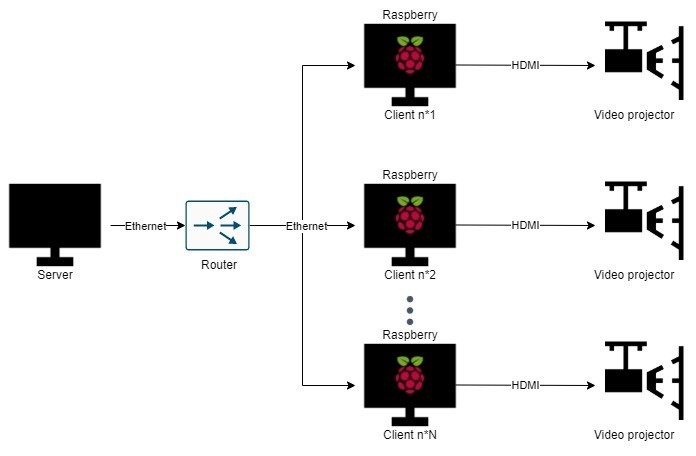
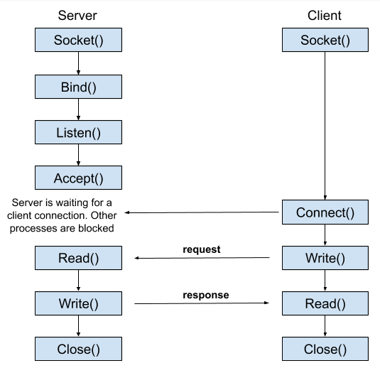

# Subversion - Submersion  

Realized by Aksel Vaillant  

Computer science student at [ENSIM](http://ensim.univ-lemans.fr/fr/index.html) - Le Mans Université (FRANCE)   

Under the direction of Ms. Catherine Cléder

## Some context  

From a goverment-region plan, Anne-Laure Fortin Tournès and Anna Street worked on [Performing Water](https://performingwater.org) and propose series of webinars designed to bring scholars, activists, and artists together in exploring how water shapes our politics and our thinking practices.  

As a group of students from the engineering school of Le Mans - [ENSIM](http://ensim.univ-lemans.fr/fr/index.html), we have chosen for our 4th year's project to create an immersive and interactive exhibition of [M. deCaires Taylor works](https://www.underwatersculpture.com). 

More information about our exhibition show here.  

Furthermore, my part consist to develop something able to synchronize video and audio streams from Raspberry Pi cards and play differents media files, whatever the extension, on video projectors and speakers. 

I will try to explain how I developped and created this program right below this part.

## What you will find here...
I worked on different packages to see my progress but mainly to propose solutions throught "templates" for my future projects and those in needs.

Through mono package, you will find a client-server architecture able to transfer files. It means you can get files from a client and put specific files on client.

And with monoPilot, you'll be able to work with 2 unix libraries nammed [omxplayer](https://github.com/popcornmix/omxplayer) (command-line video player for the Raspberry Pi) and [feh](https://feh.finalrewind.org) (image viewer) which means, from a command-line on server, you can display a picture or play a video on a client. 

To finish, in multiPilot, you can control Raspberry Pi cards from a single one and pilot them from the server.  

## Downloading

    git clone https://github.com/aksel-vaillant/immersive-experience.git

## Materials

    

     

- [X] 1 Raspberry Pi card as server or you can use a PC as well.    
- [X] 1 ethernet cable for the server.     
- [X] N Raspberry Pi cards as clients.   
- [X] 1 pair of hdmi (the output. ie a video-projector, a screen, etc) and ethernet cables for each client.       
- [X] 1 Hub to connect your clients and server all together in a proper local network.

## Commands

    help                            Print this help
    stop                            Stop the server and all clients
    
    select                          Select a connected client
    search                          Search new clients to etablish a connection
    ls                              List client computer files
    get                             Save a file from client
    put                             Send a file to a client
    play                            Play a video file
    display                         Display a picture
    ex                              Start synchronising all video streams on selected clients

## Step 1 : Making a FCP server/client able to send and save files 

    

  

### How to use it  
To make the program work, you must first fill the DEFAULT_DIRECTION_FOLDER which contains the server and client files, and add a double backslash at the end.  

It is an attribute which is located in the 2 classes : FTPClient and FTPServer.

Example test of the location of the resource files for the client :

    private final String DEFAULT_DIRECTION_FOLDER = "...\\src\\main\\resources\\CLIENT_DIR\\";

First, you have to run FTPServer.main, and then, the FTPClient.main.  
You can try mono package with a video file or a simple picture to transfer a file throught this architecture. 

Ressource https://heptadecane.medium.com/file-transfer-via-java-sockets-e8d4f30703a5

## Step 2 : Display media files and pilot a Raspberry Pi card 

The aim of this part is to connect a client to a server and display different contents such as pictures or videos. 

Once all your files setup and downloaded, you will be able to display and play those contents while piloting Raspberry Pi cards with 2 unix libraries nammed [omxplayer](https://github.com/popcornmix/omxplayer) (command-line video player for the Raspberry Pi) and [feh](https://feh.finalrewind.org) (image viewer)

First, you need to make sure you have those unix librairies on your Raspberry Pi cards

[omxplayer](https://github.com/popcornmix/omxplayer)       

    sudo install omxplayer

[feh](https://feh.finalrewind.org)      

    sudo install feh    

And for more information, I invite you to check their own documentation with commands and more. 

### What I use...

To play a video

    omxplayer --display 2 pathFile
    
    --display                   2 on HDMI 1 and 7 on HDMI 2
    
To display a picture

    feh -qrYzFD120 --zoom fill pathFile
    
    -q, --quiet                     Don't report non-fatal errors for failed loads.
    -r, --recursive                 Recursively expand any directories
    -Y, --hide-pointer              Hide the pointer
    -z, --randomize                 When viewing multiple files in a slideshow, randomize the file list before displaying. 
                                    The list is re-randomized whenever the slideshow cycles.
    -F, --fullscreen                Make the window fullscreen.
    -D, --slideshow-delay [float]   For slideshow mode, wait float seconds between automatically changing slides.
    --zoom [percent | max | fill]   Zoom images by percent when in full screen mode or when window geometry is fixed.

## Step 3 : Handling clients and synchronising video streams

In this part, I have chosen to add a search command. After 10 seconds, it will generate a message and tell you if the server found new clients (and how much) or not.     

From this list made with numbers (1,2,3,...) you will be able to select your Raspberry Pi card.

> That's why it's important to turn them on in a order you have thought before starting the server.

With the ex command, you can prepare and setup the programmation of your cards with correct files.

You only have to write which card you want with which file. 

Then, in case your client doesn't have the file yet, it will be download before playing/displaying, you will probably have lil delay. 

## FAQ 

