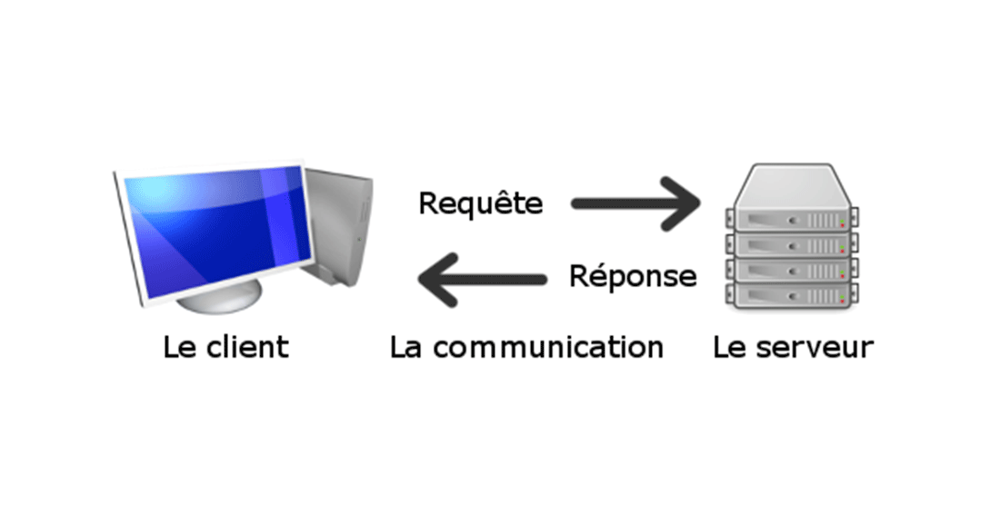

## Step 1 : Making a FCP server/client able to send and save files
Made by Aksel Vaillant with Maven and IntelliJ with a JDK 1.8

The configuration named TP allows you to run both the FTPServer main, first, and then the FTPClient main.

### Program
To make the program work, you must first fill the DEFAULT_DIRECTION_FOLDER 
which contains the server and client files, and add a double backslash at the end, 
It is an attribute which is located in the 2 classes : FTPClient and FTPServer.

Example test of the location of the resource files for the client :

    private final String DEFAULT_DIRECTION_FOLDER = "...\\src\\main\\resources\\CLIENT_DIR\\";

In the FTPServer main, you must start the server. 
The various commands are carried out correctly with the client.

Also, the choice of not splitting the command into several subparts is intended for a better user experience (UX). 

## Step 2 : Display media files and pilot a Raspberry Pi card 

The aim of this part is to connect a server with a couple of Raspeberry Pi cards to display different contents such as picture or video. 

Once all files setup, I will be able to display and run those contents while piloting those cards with omxplayer (unix library)

<em>in development</em>
